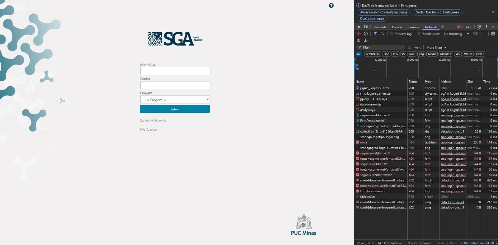
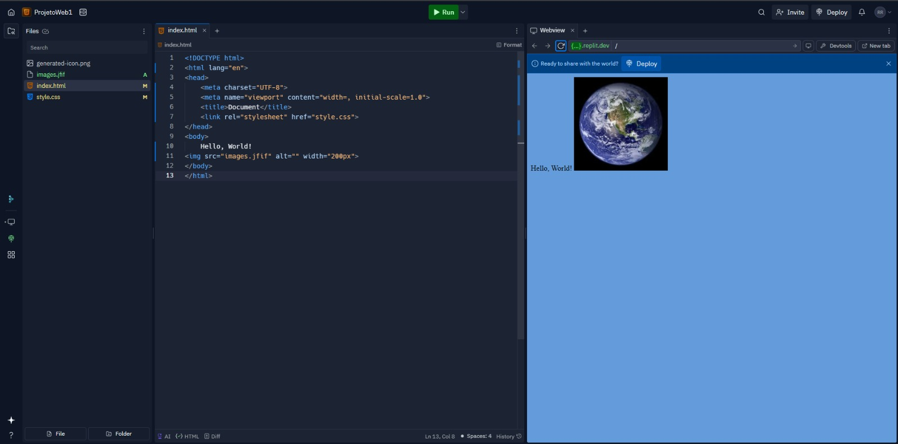

# Trabalho Prático - Semana-01

## Informações Gerais
Nome: Rafael Ramaldes Nacif de Oliveira
Matricula: 877590 

## Tela de inspeção com navegador

## Tela de projeto no Replit

## link do site do Replit
https://79c751f4-417e-427e-b44f-a591ab46f489-00-3tz72j03motqu.worf.replit.dev/menu.html
